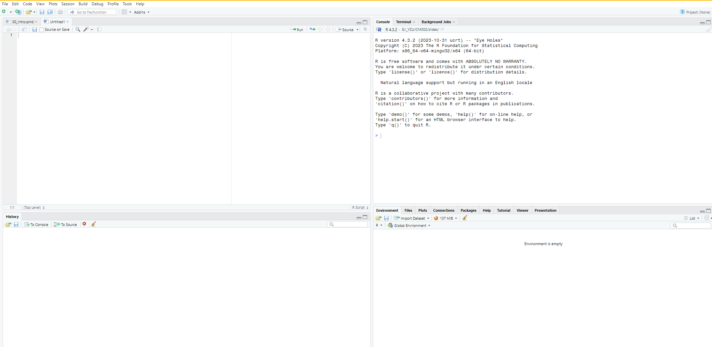
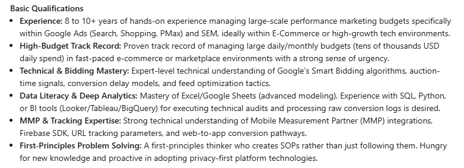
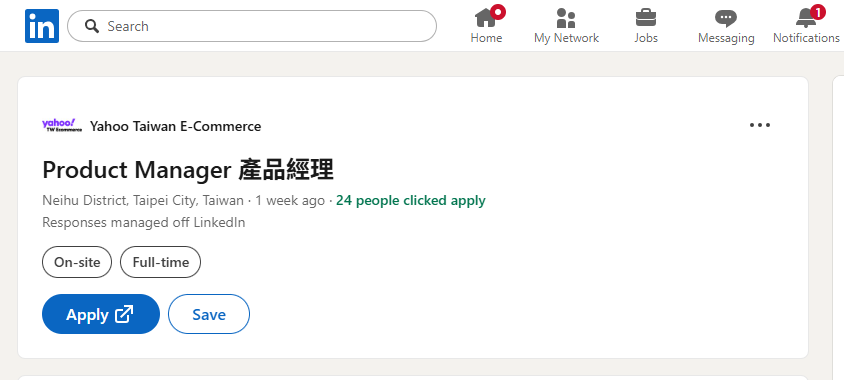
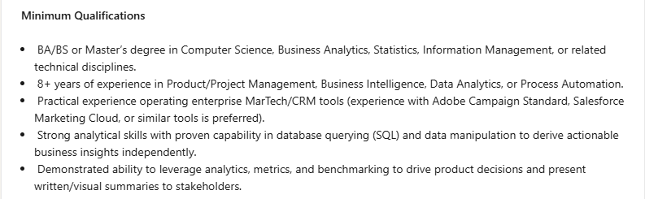

## ME

-   **Richard**, Dien Giau Bui (he/him)

-   Email: [diengiau\@nccu.edu.tw](diengiau@nccu.edu.tw)

-   Officer hour: Wednesday afternoon 14:00-16:00, R, but please email me to book in advance

-   My website: [official](https://ib.nccu.edu.tw/en/Members/Dien-Giau-Richard-Bui-44674554) and [personal](https://diengiau.github.io)

## The course

-   Mainly for business students

-   Basic, but with practical applications

-   R programming language

## Materials

-   No official textbook, but the lectures combine three main materials:

    -   Turrell, Arthur. Coding for Economists (selected practical chapters) **\[C4E\]**

    -   James, Gareth, Daniela Witten, Trevor Hastie, and Robert Tibshirani, eds. 2013. An introduction to statistical learning: with applications in R. New York: Springer. **\[ISLR\]**

    -   [Data science for economists](https://github.com/uo-ec607/lectures) class

-   My lecture slides + codes + data

    -   I will put everything into a public github: <https://github.com/diengiau/dsml>

-   But if you're new to R, please read this book for your references:

    -   R4DS: <http://r4ds.had.co.nz>

## Teaching approach

- 30% lecture
- 30% discussion
- 40% group activity

## Group

- In long term, we often work on team
- Max: 3 people
- Min: 1 person

## Scoring policy

- Midterm exam (in person): 30%

- Problem sets (in person/or group, will announced each time): 30%

- Final Project (in group): 40%

## AI policy in the class

-   There are some AI tools to use with RStudio
-   Do you want to use ChatGPT in this class?
-   If yes, ...

## My expectation/rule

-   Please don't ask for extra points at the semester end.

-   It is difficult but useful and can pass-able if you tried hard in class

- Please email me before visiting office hour. I will confirm in advance.

## Schedule this semester

- Midterm: on Week 8
- Final presentation: last two weeks
- We will have one missing/make up class: 
    - No class on week of Dec 7-8 (I'll go to a conference)
    - Make up class: we will decide near that week

## Required software

-   R programming

    -   is one statistical programming language
    -   very popular in statistics, science, and ML projects

-   RStudio: and IDE for easier using R

-   Tough at start

-   ... but maybe help you in the future

## Why R?

-   To be consistent in the EBBA program:

    -   two courses will use R
    -   then you can take other courses for Python

-   Free (open-source) and flexible to small-big projects

-   Active and broad user community

    -   E.g., iOS community vs Blackberry community

## To install R

-   First, install R from R-CRAN

    -   Step 1: download R install file; Step 2-n: Yes, Yes, Yes

-   Second, install RStudio Desktop (free version)

-   Third, install R packages

    -   For data manipulation: `install.packages("tidyverse")`; for Mac user, `install.packages("dplyr")` is enough
    -   For string and date: `stringr`, `lubridate`
    -   For statistics: `janitor`, `skimr`, `broom`, `purrr`

-   Fourth, when use the packages: `library(tidyverse)`

## Lab vs your personal computer

-   IT staffs installed R and RStudio for you

-   But more convenient to have it installed on your own computer

-   Ask me or the TA any time you have questions in class

## Another online solution

- Use Google's [Colab](https://colab.research.google.com/) platform
    - Link to your Google account

## RStudio interface

## Some useful short-cut

-   **TAB**: for complete codes automatically
-   **CTRL+ENTER**: for possible options in the codes
-   **CTRL+SHIFT+M**: for the pipe `%>%` special letter
-   **CTRL+ALT+I**: for insert a new R code block into the **QMD**/RMD file

## QMD file

-   It is a special file format by RStudio, allowing you to write and code at the same time, using the `markdown` format
-   E.g., this file is a **QMD** file
-   There are two main contents in QMD file:
    -   Text: anything you type, for reasoning, discussion so that readers can understand the analysis
    -   Code: anything inside an R code block, by **CTRL+ALT+I** shortcut or click the green C+ button in RStudio
-   It can **render** to many other file formats (**docx**, **PDF**, **HTML**, **revealjs**, ...) by click to **Render** button

## A kick-off question

-   Why coding for biz students?

## Why coding for biz students?

-   Data is now the primary input for business decisions:

-   Higher expectation on data literacy from employers

-   It is a competitive differentiator between two otherwise similar candidates in hiring and promotion

-   It sharpens judgement and critical thinking

## A quote

> "In God we trust; all others must bring data." (W. Edwards Deming)

## Job posting examples

-   I do search in September 2026

-   **linkedin**

-   keywords: "marketing manager" + "SQL"

## Example of job posting: Coupang, Taipei

## Its "basic" requirement

## Another example: Yahoo e-commerce's product manager

## Its "minimum" requirement

## Data literacy = new (English) language skill?

-   Yes

    -   Confirmed by hiring posts

    -   Teamwork with other tech teams

    -   Increasing rate of returns (income - cost)

-   Data literacy has many levels

    -   Basic/baseline: reading/making dashboards, basic SQL/Excel/R/Python, interpreting the model (regression/classification) outputs

    -   Data science/ML expertise

-   Combining your field expertise + data science skill to make you different

## Code is cool

> Don't code for pass, for passion! (maybe Richard said, 2020)

## Thank you

-   Are you ready?
