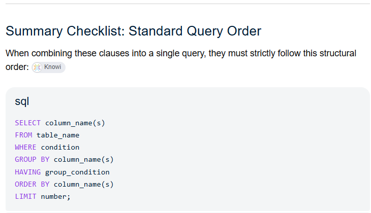

## Requirement

```{r}
library(DBI)
library(duckdb)
library(dbplyr)
library(tidyverse)

```

## Why database?

-   Small/toy data vs. big data

    -   Traffic data

    -   US census data

    -   US firms: Compustat, CRSP

-   We often use a subset of data

-   Many users want to use at the same time

-   **Bottleneck**: the original data is too big to store in a computer or fit the memory

-   The answer is then a database

## Database 101

-   Database is like many tables/dataframe organized within the same database

    -   A table in database \~ a dataframe in R

    -   Each row is identified by a unique key

    -   Like one firm & one year, we only have one unique identified row

-   To get data, we need to write down the **query** to retrieve data

    -   Use a language namely **SQL** (**S**tructured **Q**uery **L**anguage)

-   After queried data, we **collect** them to R/Python and continue with analysis

## SQL

-   A powerful tool and become prerequisite for many data science jobs

-   But this language is archaic and less intuitive than R we have in this course

-   We will cover some examples working with databases in this lecture

    -   Then, I'll show you how to use `tidyverse` (easier!) to work with database

## Connect to a database

-   For SQLite or DuckDB, a database is just a file

-   For other complex database (like WRDS), they are a system that we need more information to connect

## Example 1: DuckDB

-   We have a database namely `nycflights.duckdb` in the `data` folder

    -   The path to database from our working directory is: `data/nycflights.duckdb`

-   Inside this database, we have one table: `nycflights13`

## Connect to DuckDB

```{r}
con <- dbConnect(duckdb(), dbdir = "data/nycflights.duckdb")

# list tables in a database
dbListTables(con)
```

## SQL query syntax



## Just take first 100 rows

```{sql connection=con}
SELECT * FROM nycflights13 LIMIT 100;
```

## Filter data on condition

-   How to filter only the delayed departure flights?

```{sql connection=con}
SELECT * FROM nycflights13;
```

## Aggregation data in SQL

Count how many flights in each month in 2013

```{sql connection=con}
SELECT month, COUNT(*) FROM nycflights13 WHERE year = 2013 GROUP BY month;

```

## Where is the query data?

-   Not in R

-   So where is the queried data?

## Take the queried data to R

-   Use `dbGetQuery(con, SQL_QUERY)`

```{r}
res <- dbGetQuery(con, "SELECT * FROM nycflights13")
head(res)
```

## Use `tidyverse` to query data

-   The key reason I choose R and `tidyverse` is to have a universal language for you to do any data science stuffs

-   Fortunately, `tidyverse` can work with SQL

    -   Use `tbl(con, "table_name")`

```{r}
tbl(con, "nycflights13")
```

## Then

-   combine with any tidyverse functions we learn

## Filter data

```{r}
tbl(con, "nycflights13") %>% 
  filter(year==2013, month==1)
```

## Aggregation data

```{r}
tbl(con, "nycflights13") %>% 
  filter(year==2013) %>% 
  count(month)
```

## Try to save results

```{r}
res = tbl(con, "nycflights13") %>% 
  filter(year==2013) %>% 
  count(month)
```

## Look at `res` in the Environment panel

-   It is not a dataframe in R

    -   but a list

-   R will be lazy as default

    -   It will not run if we do have plan to `collect` the results

-   To get it as dataframe, we need to `collect` it by the end if you are sure want to get the results

## Try again

```{r}
res2 = tbl(con, "nycflights13") %>% 
  filter(year==2013) %>% 
  count(month) %>% 
  collect()
```

## Save dataframe from R to database

```{r}
dbWriteTable(con, "flights_per_month", res2)
```

## Disconnect database

-   After queried well data, remember to disconnect database to avoid errors

```{r}
dbDisconnect(con)
```

## Example 2: Connect to WRDS

```{r}
library(DBI)
library(RPostgres)
# 1. Set your credentials securely in your R environment
Sys.setenv(WRDS_USER = "your_wrds_username")
Sys.setenv(WRDS_PASSWORD = "your_wrds_password")

# 2. Connect to the WRDS PostgreSQL backend
wrds <- dbConnect(
  Postgres(),
  host = "wrds-pgdata.wharton.upenn.edu",
  port = 9737,
  dbname = "wrds",
  sslmode = "require",
  user = Sys.getenv("WRDS_USER"),
  password = Sys.getenv("WRDS_PASSWORD")
)
```

## All libraries/schema in WRDS

```{r}
res <- dbSendQuery(wrds, "select distinct table_schema
                   from information_schema.tables
                   order by table_schema")
all_lib <- dbFetch(res, n=-1)
dbClearResult(res)
```

## Some key schema/libraries

-   Compustat: `comp`

-   Execucomp: `comp_execucomp`

-   CRSP: `crsp`

## All tables within a library

```{r}
res <- dbSendQuery(wrds, "select distinct table_name
                   from information_schema.columns
                   where table_schema='comp'
                   order by table_name")
df_in_lib <- dbFetch(res, n=-1)
dbClearResult(res)
```

## Variables within a given dataset

```{r}
res <- dbSendQuery(wrds, "select column_name
                   from information_schema.columns
                   where table_schema='comp'
                   and table_name='funda'
                   order by column_name")
variables_in_funda <- dbFetch(res, n=-1)
dbClearResult(res)
```

## Get advertising and R&D data

```{r}
res <- dbSendQuery(wrds, "select gvkey, fyear, xad, xrd
                   from comp_na_daily_all.funda
                   where fyear between 2000 and 2010 
                     and xad is not null 
                     and xrd is not null")

data <- dbFetch(res, n=10) |> 
    unique()
dbClearResult(res)
```

## Rewrite in `tidyverse`

```{r}
tbl(wrds, in_schema("comp", "funda")) %>% 
  filter(fyear >= 2000, fyear <= 2010,
         !is.na(xad), !is.na(xrd)) %>%
  select(gvkey, fyear, xad, xrd)

```

## Collect the query to get data to R

```{r}
res = tbl(wrds, in_schema("comp", "funda")) %>% 
  filter(fyear >= 2000, fyear <= 2010,
         !is.na(xad), !is.na(xrd)) %>%
  select(gvkey, fyear, xad, xrd) %>% 
  collect()
```

## Thanks
